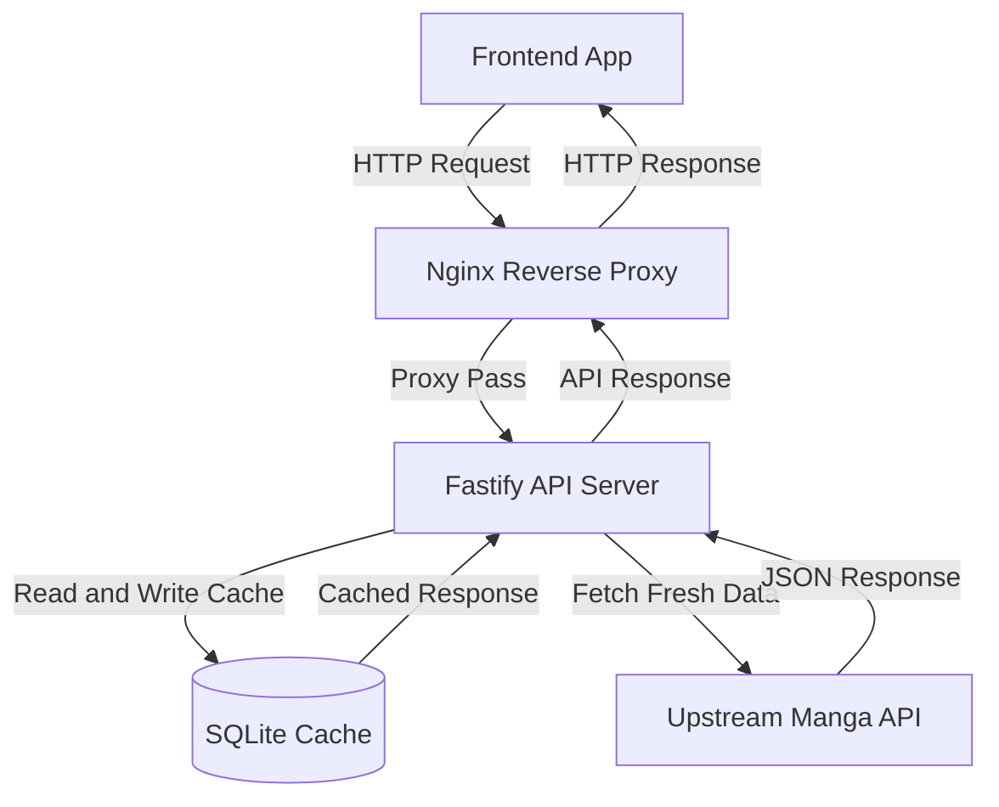
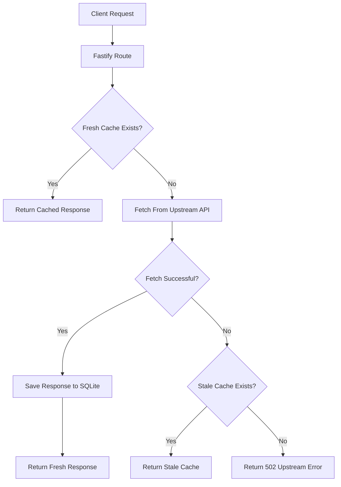
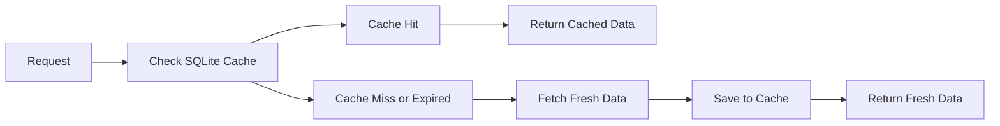

<div align="center">

# apimanga

### Lightweight Manga API Proxy-Cache for Small VPS Environments

<p>
  
  
  
  
  
</p>

<p>
  <b>Fastify API layer that caches manga responses, reduces repeated upstream calls, and keeps a manga reader frontend stable on a small VPS.</b>
</p>

<p>
  <a href="#overview">Overview</a>
  ·
  <a href="#features">Features</a>
  ·
  <a href="#architecture">Architecture</a>
  ·
  <a href="#endpoints">Endpoints</a>
  ·
  <a href="#deployment">Deployment</a>
  ·
  <a href="#roadmap">Roadmap</a>
</p>

</div>

---

## Overview

**apimanga** is a lightweight proxy-cache API for manga reader applications.

It sits between a frontend app and an upstream manga API, then handles caching, request throttling, timeout control, and stale fallback from a small backend service.

Instead of letting the frontend call the upstream API directly, this service provides a more stable backend layer that is easier to monitor, tune, and deploy.

Built for a small VPS setup:

```txt
1 vCPU · 2GB RAM · Node.js · PM2 · Nginx · SQLite
```

---

## Features

<table>
<tr>
<td width="50%">

### Proxy API

* Latest comics
* Popular comics
* Top comics
* Recommended comics
* Search endpoint
* Genre endpoint
* Detail endpoint
* Chapter endpoint

</td>
<td width="50%">

### Cache Layer

* SQLite response cache
* Per-endpoint TTL
* Cache hit and miss headers
* Stale cache fallback
* Cache stats endpoint
* Lightweight local storage

</td>
</tr>
<tr>
<td width="50%">

### Protection Layer

* Public rate limit
* Upstream request throttle
* Request timeout
* Controlled external calls
* Graceful fallback on failure

</td>
<td width="50%">

### VPS Ready

* Node.js 20+
* PM2 compatible
* Nginx reverse proxy
* Low memory usage
* Simple environment configuration

</td>
</tr>
</table>

---

## Architecture



---

## Request Flow



---

## Tech Stack

| Layer           | Tech                |
| --------------- | ------------------- |
| Runtime         | Node.js 20+         |
| Web Framework   | Fastify             |
| Cache Storage   | SQLite              |
| SQLite Driver   | better-sqlite3      |
| Rate Limit      | @fastify/rate-limit |
| CORS            | @fastify/cors       |
| Process Manager | PM2                 |
| Reverse Proxy   | Nginx               |
| Server          | Azure VPS           |

---

## Endpoints

| Method | Endpoint                  | Description                              |
| ------ | ------------------------- | ---------------------------------------- |
| `GET`  | `/`                       | Basic service info                       |
| `GET`  | `/health`                 | Health check with uptime                 |
| `GET`  | `/cache/stats`            | Cache summary                            |
| `GET`  | `/comic/latest`           | Latest comic updates                     |
| `GET`  | `/comic/popular`          | Popular comics                           |
| `GET`  | `/comic/top`              | Top comics                               |
| `GET`  | `/comic/recommended`      | Recommended comics                       |
| `GET`  | `/comic/search?q=keyword` | Search comic by keyword                  |
| `GET`  | `/comic/genres`           | List available genres                    |
| `GET`  | `/comic/genre/:slug`      | Comics by genre slug                     |
| `GET`  | `/comic/detail/:slug`     | Comic detail by slug                     |
| `GET`  | `/comic/chapter/:slug`    | Chapter detail by slug                   |
| `GET`  | `/comic/only/:type`       | Filter by `manga`, `manhwa`, or `manhua` |

---

## Cache Behavior

Every proxied response is stored with a cache key and TTL.



If upstream refresh fails but stale cache exists, the service can still return the older cached payload as a fallback.

### Cache Response Headers

| Header        | Value             | Meaning                                   |
| ------------- | ----------------- | ----------------------------------------- |
| `x-cache-key` | cache key         | Internal cache key                        |
| `x-cache`     | `HIT`             | Fresh cache returned                      |
| `x-cache`     | `MISS`            | No cache, fetched upstream                |
| `x-cache`     | `STALE-REFRESHED` | Old cache existed, refreshed successfully |
| `x-cache`     | `STALE-FALLBACK`  | Upstream failed, stale cache returned     |
| `x-upstream`  | `sanka`           | Response was refreshed from upstream      |

---

## Default TTL Strategy

| Data Type   | Env               | Default    |
| ----------- | ----------------- | ---------- |
| Latest      | `TTL_LATEST`      | 10 minutes |
| Popular     | `TTL_POPULAR`     | 1 hour     |
| Top         | `TTL_TOP`         | 1 hour     |
| Recommended | `TTL_RECOMMENDED` | 1 hour     |
| Genres      | `TTL_GENRES`      | 24 hours   |
| Genre Page  | `TTL_GENRE`       | 1 hour     |
| Search      | `TTL_SEARCH`      | 30 minutes |
| Detail      | `TTL_DETAIL`      | 6 hours    |
| Chapter     | `TTL_CHAPTER`     | 7 days     |

General rule:

```txt
Frequently changing data  -> shorter TTL
Rarely changing data      -> longer TTL
```

---

## Environment Variables

Copy `.env.example` to `.env`.

```bash
cp .env.example .env
```

| Variable                        | Default                            | Description                |
| ------------------------------- | ---------------------------------- | -------------------------- |
| `NODE_ENV`                      | `production`                       | Runtime environment        |
| `HOST`                          | `127.0.0.1`                        | Server host                |
| `PORT`                          | `4000`                             | Server port                |
| `SANKA_BASE_URL`                | `https://www.sankavollerei.web.id` | Upstream API base URL      |
| `SANKA_PROVIDER`                | `bacakomik`                        | Upstream provider segment  |
| `SANKA_MAX_REQUESTS_PER_MINUTE` | `30`                               | Internal upstream throttle |
| `SANKA_TIMEOUT_MS`              | `15000`                            | Upstream request timeout   |
| `CACHE_DB_PATH`                 | `./data/cache.sqlite`              | SQLite database path       |
| `PUBLIC_RATE_LIMIT_MAX`         | `120`                              | Public request limit       |
| `PUBLIC_RATE_LIMIT_WINDOW`      | `1 minute`                         | Public rate-limit window   |

---

## Local Development

```bash
git clone https://github.com/allifiz/apimanga.git
cd apimanga

npm install
cp .env.example .env
npm run dev
```

Open:

```txt
http://127.0.0.1:4000/health
```

Example response:

```json
{
  "ok": true,
  "uptime": 12.34,
  "now": "2026-06-25T00:00:00.000Z"
}
```

---

## Deployment

Recommended production setup:

```txt
Ubuntu VPS
Node.js 20+
PM2
Nginx
SQLite
```

Start the app with PM2:

```bash
pm2 start src/server.js --name apimanga --max-memory-restart 500M
pm2 save
```

For small VPS specs:

```txt
1 vCPU
2GB RAM
1 Node.js process
SQLite local file cache
```

Recommended throttle:

```env
SANKA_MAX_REQUESTS_PER_MINUTE=20
PUBLIC_RATE_LIMIT_MAX=120
PUBLIC_RATE_LIMIT_WINDOW=1 minute
```

---

## Example Nginx Config

```nginx
server {
    listen 80;
    server_name api.example.com;

    location / {
        proxy_pass http://127.0.0.1:4000;
        proxy_http_version 1.1;

        proxy_set_header Host $host;
        proxy_set_header X-Real-IP $remote_addr;
        proxy_set_header X-Forwarded-For $proxy_add_x_forwarded_for;
        proxy_set_header X-Forwarded-Proto $scheme;
    }
}
```

---

## Cache Stats

Endpoint:

```txt
GET /cache/stats
```

Example response:

```json
{
  "total": 120,
  "expired": 8,
  "active": 112
}
```

---

## Project Structure

```txt
apimanga
├── src
│   └── server.js
├── data
│   └── cache.sqlite
├── .env.example
├── package.json
└── README.md
```

---

## Roadmap

* [ ] Add protected admin endpoint for clearing cache
* [ ] Add OpenAPI or Swagger documentation
* [ ] Add Dockerfile for portable deployment
* [ ] Add GitHub Actions install and check workflow
* [ ] Add cache warm-up job for popular endpoints
* [ ] Add uptime and upstream status reporting
* [ ] Add request logging dashboard

---

## Author

Built by [@allifiz](https://github.com/allifiz)

---

## License

MIT
